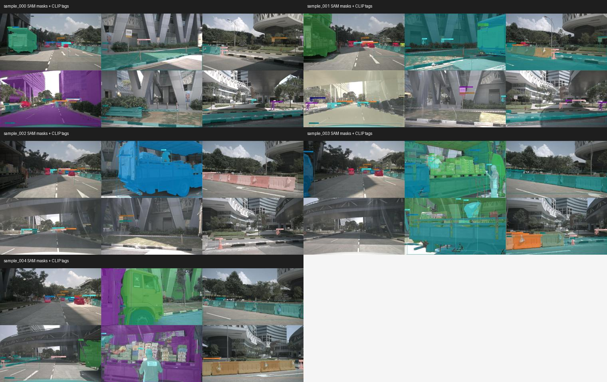
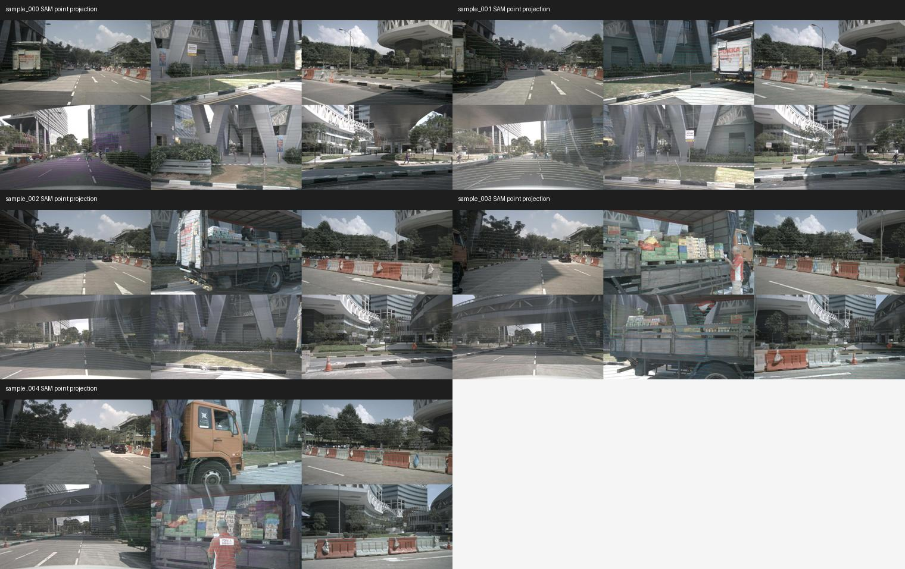
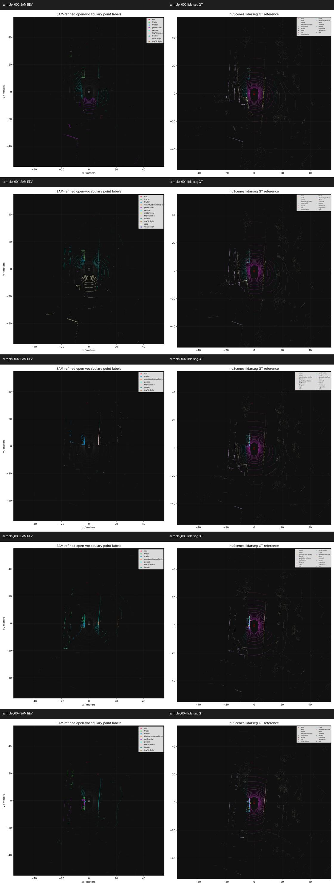
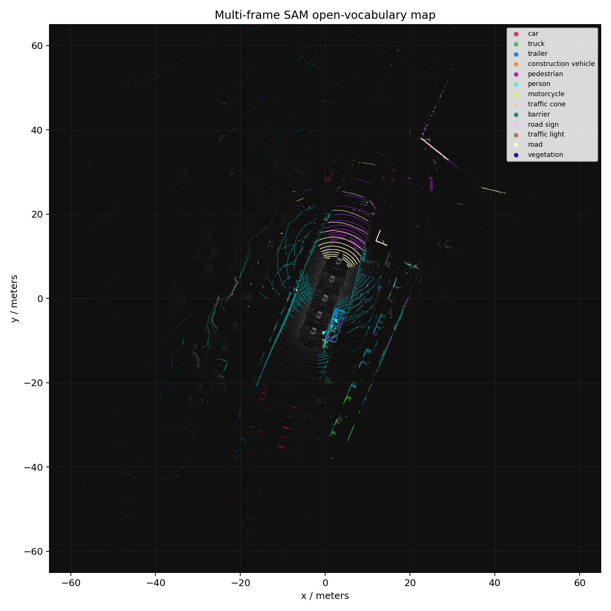

# 3D-Practive: OV3D / OV-SAM3D Open-Vocabulary 3D Reproduction Notes

This repository stores the isolated open-vocabulary 3D reproduction branch built after the IPFP/PTv3 experiments.

The current executable scaffold is an OV-SAM3D/OV3D-style visual closed loop on nuScenes-mini.
It now contains two stages:

1. A first OWL-ViT box projection scaffold.
2. A SAM + CLIP upgrade with lightweight lidarseg diagnostics and multi-frame fusion.

```text
nuScenes-mini multi-camera images
-> OWL-ViT open-vocabulary 2D detections
-> optional SAM mask refinement + CLIP crop tagging
-> LiDAR-camera projection
-> 3D point label aggregation
-> BEV / camera / PLY visualizations
```

This is not yet a faithful official OV-SAM3D implementation. It uses OWL-ViT as the open-vocabulary detector and SAM as the mask refiner, with CLIP crop scores used as a lightweight RAM/Tag2Text substitute.

## Contents

- `scripts/run_open_vocab_nuscenes_owlvit.py`: runnable nuScenes-mini open-vocabulary 2D-to-3D visualization scaffold.
- `scripts/run_sam_clip_eval_multiframe.py`: SAM-refined masks, CLIP crop tags, lidarseg mapped diagnostics, and multi-frame semantic fusion.
- `scripts/aggregate_sam_clip_metrics.py`: aggregates run-level, sample-level, per-class, and label-source ablation metrics.
- `docs/DATA_MANIFEST.md`: remote data symlink layout and isolation policy.
- `docs/OVSAM3D_OV3D_REPRO_STATUS.md`: current result summary, limitations, and next steps.
- `docs/SAM_CLIP_LABEL_ABLATION.md`: label-source ablation conclusion after comparing OWL-only, CLIP-only, and hybrid labels.
- `results/ovsam3d_owlvit_nuscenes_mini/`: generated visualizations for five nuScenes-mini samples.
- `results/ovsam3d_sam_clip_eval_nuscenes_mini/`: SAM/CLIP upgraded visualizations and diagnostics for five nuScenes-mini samples.
- `results/ovsam3d_metric_ablation_report/`: aggregate metric and label-source diagnosis tables.

## Main Results

### SAM / CLIP / Evaluation / Multi-frame Upgrade

This run advances the scaffold in four directions at once:

- OWL-ViT boxes are refined into SAM masks.
- CLIP crop labels are stored as automatic open-vocabulary tags.
- Point labels are mapped to nuScenes lidarseg classes for a lightweight quality check.
- Five frames are fused into a global-coordinate semantic map.

| Sample | Points | Box assigned ratio | SAM assigned ratio | Box mapped accuracy | SAM mapped accuracy |
| --- | ---: | ---: | ---: | ---: | ---: |
| sample_000 | 34688 | 0.311 | 0.171 | 0.072 | 0.134 |
| sample_001 | 34720 | 0.371 | 0.248 | 0.231 | 0.336 |
| sample_002 | 34720 | 0.154 | 0.105 | 0.036 | 0.045 |
| sample_003 | 34688 | 0.327 | 0.265 | 0.240 | 0.336 |
| sample_004 | 34752 | 0.347 | 0.214 | 0.341 | 0.489 |

The SAM stage assigns fewer points than raw boxes, but mapped accuracy improves on all five checked samples. This is the desired direction for this diagnostic: SAM reduces broad box spillover, while the remaining errors are mostly label calibration and open-vocabulary-to-nuScenes mismatch.

Key visualizations:









See `results/ovsam3d_sam_clip_eval_nuscenes_mini/SAM_CLIP_EVAL_MULTIFRAME_REPORT.md` for the compact run report and `run_summary.json` for per-region diagnostics.

### Label-Source Ablation

The latest diagnosis compares OWL-only, CLIP-only, and hybrid labels under the same SAM masks.
The best current route is `OWL-ViT label -> SAM mask -> person/pedestrian merge -> 3D projection`.

| Run | Label source | CLIP min | SAM mapped accuracy | SAM macro IoU |
| --- | --- | ---: | ---: | ---: |
| hybrid merge | hybrid | 0.12 | 0.304 | 0.092 |
| owl merge | OWL-only | 0.12 | 0.464 | 0.134 |
| clip merge | CLIP-only | 0.12 | 0.298 | 0.091 |
| hybrid clip045 | hybrid | 0.45 | 0.329 | 0.126 |
| hybrid clip060 | hybrid | 0.60 | 0.356 | 0.098 |

CLIP crop retagging is currently not reliable enough for these outdoor driving crops. Raising
the CLIP takeover threshold helps hybrid labels, but OWL-only still wins on both mapped accuracy
and macro IoU. See `docs/SAM_CLIP_LABEL_ABLATION.md` for the full table and interpretation.

The low full-scene macro IoU is mostly a split-metric issue. For the best OWL-only SAM run,
object assigned accuracy is `0.464`, object micro IoU is `0.385`, and object macro IoU is
`0.194`; the stuff/background group is `0.000` because the current route does not segment
road/building/sidewalk/vegetation. See
`results/ovsam3d_metric_ablation_report/group_metrics.csv` for the full split.

For a stricter object-mask diagnostic, `frequent_object` keeps only object classes with at
least `100` GT points in the five-sample mini split. On that protocol, the best OWL-only
SAM run reaches `0.413` micro IoU and `0.350` macro IoU across
`barrier / car / pedestrian / traffic cone / truck`. See
`results/ovsam3d_metric_ablation_report/OBJECT_ONLY_DIAGNOSTIC_REPORT.md`.

### Official-Like Superpoint Step

The first official-like step adds 3D superpoint overlap voting after OWL-only + SAM
projection. On the same five nuScenes-mini samples, the default superpoint setting improves
object micro IoU from `0.385` to `0.400`, and frequent-object macro IoU from `0.350` to
`0.375`. A stricter threshold ablation reaches `0.426` object micro IoU, but with lower
coverage and worse macro balance. See `docs/OFFICIAL_LIKE_SUPERPOINT_EXPERIMENT.md`.

### Initial OWL-ViT Box Scaffold

Five nuScenes-mini samples were processed. Each sample includes:

- six-camera 2D open-vocabulary detection montages,
- six-camera LiDAR depth projection montages,
- six-camera projected open-vocabulary point label montages,
- BEV open-vocabulary point labels,
- BEV nuScenes lidarseg GT reference using raw ids,
- colored `.ply` point cloud,
- per-sample `summary.json`.

Top-level contact sheets:

- `results/ovsam3d_owlvit_nuscenes_mini/contact_sheet_open_vocab_boxes.jpg`
- `results/ovsam3d_owlvit_nuscenes_mini/contact_sheet_open_vocab_projection.jpg`
- `results/ovsam3d_owlvit_nuscenes_mini/contact_sheet_bev_vs_gt.jpg`

## Reproduction

Use the existing isolated remote data layout:

```text
/root/autodl-tmp/open_vocab3d_repro/data/nuscenes_mini
/root/autodl-tmp/open_vocab3d_repro/data/semantic_kitti
```

Example:

```bash
cd /root/autodl-tmp/open_vocab3d_repro
HF_HOME=/root/autodl-tmp/open_vocab3d_repro/weights/hf_home \
TRANSFORMERS_CACHE=/root/autodl-tmp/open_vocab3d_repro/weights/hf_cache \
/root/autodl-tmp/ipfp_repro/.venv/bin/python \
  scripts/run_open_vocab_nuscenes_owlvit.py \
  --sample-index 0 \
  --threshold 0.06
```

SAM / CLIP upgraded run:

```bash
cd /root/autodl-tmp/open_vocab3d_repro
HF_HOME=/root/autodl-tmp/open_vocab3d_repro/weights/hf_home \
TRANSFORMERS_CACHE=/root/autodl-tmp/open_vocab3d_repro/weights/hf_cache \
/root/autodl-tmp/ipfp_repro/.venv/bin/python \
  scripts/run_sam_clip_eval_multiframe.py \
  --sample-indices 0-4 \
  --max-detections-per-camera 12 \
  --out-dir outputs/ovsam3d_sam_clip_eval_nuscenes_mini
```

## Current Caveats

- The current tagger is CLIP crop scoring, not a full RAM/Tag2Text/VLM captioning stack.
- Object-like categories work better than stuff categories such as road and sidewalk.
- Open-vocabulary prompt labels do not perfectly match nuScenes closed-set semantic labels.
- Treat the current result as a visual reproduction and diagnostic scaffold, not a benchmark reproduction.

## Next Steps

1. Use OWL-only labels plus SAM masks as the default branch for larger nuScenes-mini split expansion.
2. Improve stuff-class coverage with a separate road/building/sidewalk/vegetation route instead of object boxes only.
3. Add SemanticKITTI front-camera mode for comparison with prior closed-set experiments.
4. If official OV-SAM3D/OV3D code becomes available, adapt its 2D mask/tag stage into this output interface.
