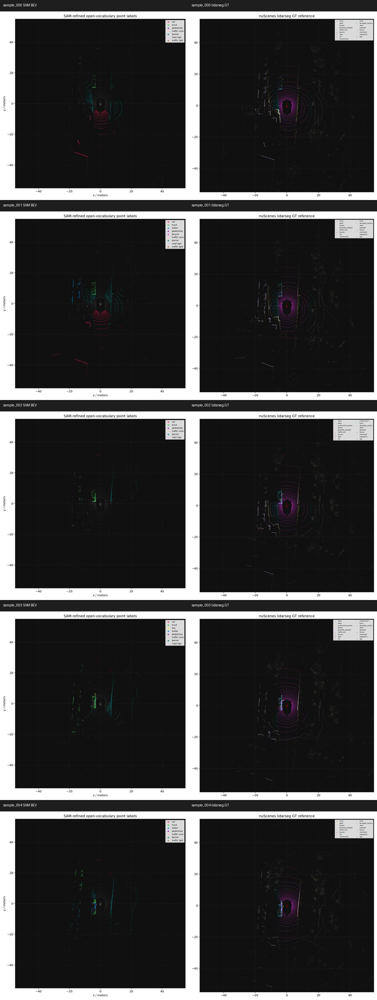
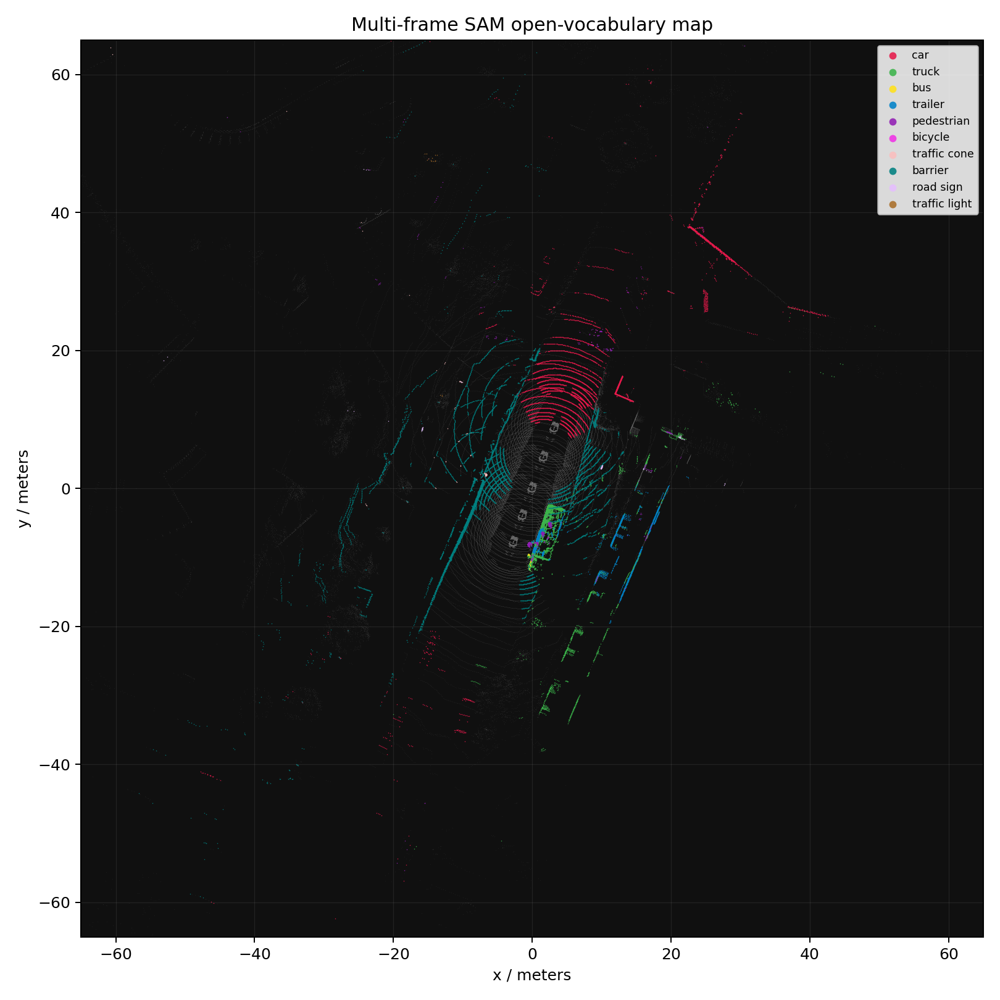

# SAM / CLIP Label Ablation Notes

This note records the label-source diagnosis after the first SAM/CLIP open-vocabulary 3D run.
All runs use the same five nuScenes-mini samples, six cameras per sample, OWL-ViT detections,
SAM masks, and LiDAR-camera projection. The only changed factors are the label source and the
CLIP takeover threshold.

## Setup

- Dataset: `nuScenes-mini` with lidarseg mini labels.
- Samples: `0-4`.
- Total points evaluated: `173568`.
- Max detections per camera: `12`.
- Point assignment stages:
  - `box`: points inside the OWL-ViT 2D boxes.
  - `sam`: points inside the SAM masks prompted by the same boxes.
- Main post-processing: `person` is merged into `pedestrian` for nuScenes lidarseg diagnostics.

## Run-Level Results

| Run | Label source | CLIP min | Stage | Coverage | Mapped acc | Macro IoU |
| --- | --- | ---: | --- | ---: | ---: | ---: |
| baseline previous hybrid | hybrid | n/a | box | 0.302 | 0.206 | 0.082 |
| baseline previous hybrid | hybrid | n/a | sam | 0.201 | 0.304 | 0.092 |
| hybrid merge | hybrid | 0.12 | box | 0.302 | 0.206 | 0.082 |
| hybrid merge | hybrid | 0.12 | sam | 0.201 | 0.304 | 0.092 |
| owl merge | OWL-only | 0.12 | box | 0.302 | 0.328 | 0.097 |
| owl merge | OWL-only | 0.12 | sam | 0.201 | 0.464 | 0.134 |
| clip merge | CLIP-only | 0.12 | box | 0.302 | 0.196 | 0.080 |
| clip merge | CLIP-only | 0.12 | sam | 0.201 | 0.298 | 0.091 |
| hybrid clip030 | hybrid | 0.30 | sam | 0.201 | 0.305 | 0.100 |
| hybrid clip045 | hybrid | 0.45 | sam | 0.201 | 0.329 | 0.126 |
| hybrid clip060 | hybrid | 0.60 | sam | 0.201 | 0.356 | 0.098 |

## Split Metric Diagnosis

The low full-scene macro IoU should be read with split metrics, because the current
pipeline is an object-prompt route. It uses OWL-ViT boxes and SAM masks, so it
naturally finds discrete objects better than road/building/sidewalk/vegetation.

Best current run, `ovsam3d_ablation_owl_merge_person_nuscenes_mini`, SAM stage:

| Group | Coverage | Group pred ratio | Assigned acc | Micro recall | Micro IoU | Macro IoU | Classes |
| --- | ---: | ---: | ---: | ---: | ---: | ---: | ---: |
| full | 0.201 | 0.200 | 0.464 | 0.134 | 0.116 | 0.134 | 13 |
| object | 0.201 | 0.200 | 0.464 | 0.692 | 0.385 | 0.194 | 9 |
| stuff | 0.201 | 0.000 | n/a | 0.000 | 0.000 | 0.000 | 4 |

Interpretation:

- The object route is useful: among points assigned to object labels, `46.4%` are
  correct, and object micro IoU reaches `0.385`.
- Object macro IoU is still only `0.194` because rare or hard classes such as
  `bus`, `bicycle`, `construction vehicle`, and `trailer` receive little or no
  correct support in this five-sample mini split.
- Stuff classes are not solved by the current object-centric detector/mask route.
  In the best OWL-only run, `road`, `building`, `sidewalk`, and `vegetation` get
  zero predicted support, so they pull the full-scene macro IoU down.
- Hybrid/CLIP runs sometimes assign a small number of stuff points, but the stuff
  recall remains about `0.02` and stuff macro IoU stays around `0.008`, so this is
  not a real background segmentation solution.

## Conclusion

The best current route is:

`OWL-ViT label -> SAM mask -> person/pedestrian merge -> 3D projection`.

The strongest run is `ovsam3d_ablation_owl_merge_person_nuscenes_mini`:

- SAM mapped accuracy: `0.464`.
- SAM macro IoU: `0.134`.
- Coverage: `0.201`.

This is better than both the initial hybrid run and CLIP-only. The main diagnosis is that
SAM is useful, but CLIP crop retagging is currently harmful for this outdoor driving setup.
At the default `min_clip_score=0.12`, CLIP changes `45.1%` of OWL region labels and lowers
SAM mapped accuracy from `0.464` to about `0.304`. Increasing the threshold reduces CLIP
takeover and improves hybrid accuracy, but none of the hybrid thresholds beats OWL-only.

## What This Means

- The current bottleneck is label selection, not SAM mask geometry.
- SAM consistently reduces box spillover: it lowers coverage from about `0.302` to `0.201`,
  while increasing mapped accuracy in the useful runs.
- CLIP crop classification is too unstable for small/distant nuScenes objects and construction
  scenes. It often converts OWL labels into visually plausible but closed-set-wrong labels.
- Stuff classes such as `road`, `building`, `sidewalk`, and `vegetation` are not solved by this
  object-prompt route. Their low IoU should not be read as a full-scene benchmark failure; it is
  a known limitation of the current object-centric prompt list.

## Main Result Files

- Aggregate report: `results/ovsam3d_metric_ablation_report/METRIC_ABLATION_REPORT.md`
- Run-level CSV: `results/ovsam3d_metric_ablation_report/run_level_metrics.csv`
- Split metric CSV: `results/ovsam3d_metric_ablation_report/group_metrics.csv`
- Per-class CSV: `results/ovsam3d_metric_ablation_report/per_class_metrics.csv`
- Label transition CSV: `results/ovsam3d_metric_ablation_report/label_source_transitions.csv`

Best-current visualization set:

- `results/ovsam3d_ablation_owl_merge_person_nuscenes_mini/contact_sheet_sam_clip_masks.jpg`
- `results/ovsam3d_ablation_owl_merge_person_nuscenes_mini/contact_sheet_sam_point_projection.jpg`
- `results/ovsam3d_ablation_owl_merge_person_nuscenes_mini/contact_sheet_sam_bev_vs_gt.jpg`
- `results/ovsam3d_ablation_owl_merge_person_nuscenes_mini/multiframe_sam_open_vocab_bev.png`
- `results/ovsam3d_ablation_owl_merge_person_nuscenes_mini/multiframe_sam_open_vocab_points.ply`

## Recommended Next Step

Use `OWL-only + SAM + person/pedestrian merge` as the default branch for the next split expansion.
Do not use CLIP crop retagging as the primary label source unless it is constrained by a stronger
calibration rule. The next experiment should expand from five samples to a larger nuScenes-mini
subset, but the metric should always be reported as full/object/stuff splits. To improve the full
macro IoU, add a separate stuff-class route instead of expecting object boxes to recover road,
building, sidewalk, and vegetation.
